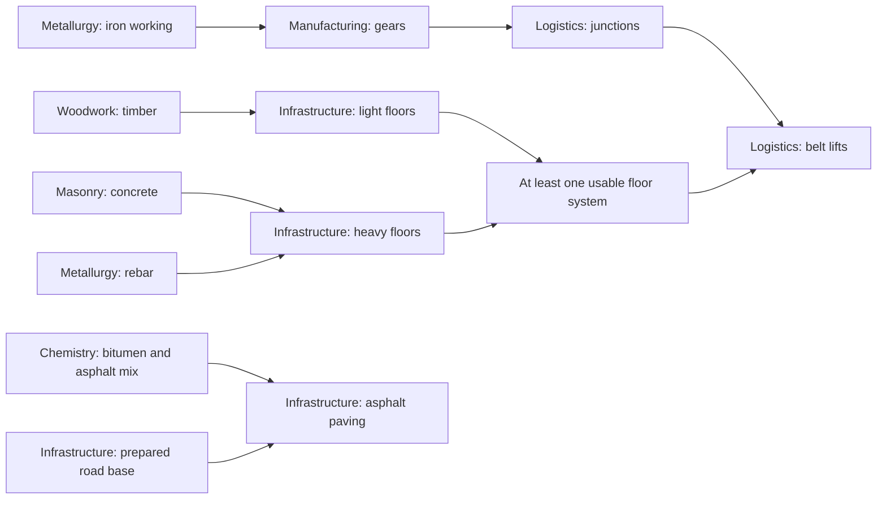

# Research, insight, and player skills

Planning brief, 2026-08-27. **Approved next workstream; foundations partly shipped, redesign not balanced.** This is the progression
companion to the [construction and materials plan](CONSTRUCTION-MATERIALS-PLAN.md). It establishes
an expandable technology graph, a separate player skill tree, and an insight economy based on new
practical achievements rather than unlimited deliveries of the same goods. Release numbers remain
unassigned. The [roadmap's combined sequence](HEXFACTORY-PLAN.md#what-to-do-next) gives these two
plans immediate priority before Living Lattice, Regional Discovery or any other roadmap feature.
Their old v0.26/v0.27 reservations are withdrawn. Tuning proposals and validation gates remain in force.

**Delivery status:** v0.26.0 [Primitive Workshops](OPENING-FOUNDATION-RECORD.md) supplies baseline
manufacturing and recovery; v0.27/v0.28 price transport and essential stations in parts.
v0.29.0 [Research Foundations](RESEARCH-FOUNDATIONS-RECORD.md) supplies branch/stage registries and
native research availability shared by purchase, map and guidance. That release kept prices, prerequisites, effects and request rewards unchanged.
v0.30.0 [Research Atlas](RESEARCH-ATLAS-RECORD.md) pulls forward the central spatial tree, original SVG
emblems, hover/focus details and deliberate purchases. v0.31.0
[Foundation Commissions](FOUNDATION-COMMISSIONS-RECORD.md) grants the four starter automation
nodes when Prove the line completes, with typed effects replacing ad-hoc unlock and bonus fields.
Those four are no longer insight purchases; later prices and request rewards are unchanged. Continue
phase 1 with the component/contract and remaining economy audit. v0.32.0
[Industrial Bills](INDUSTRIAL-BILLS-RECORD.md) prices the five industrial stations and corrects
construction-order accounting; complete commission/research startup costing is still outstanding. Timed opening validation is withdrawn. This is not the finite insight
economy or separate skill system. Larger future discipline lanes, evidence projects, tracking and skills remain planned.

## Design commitments

- Research should look like a map of possibilities: recognisable disciplines, clear progression,
  and understandable connections between them.
- Staging follows what the player can make and demonstrate. A large insight balance cannot buy
  past missing knowledge or a practical prerequisite.
- Essential tools stay accessible. Scarcer insight must not make belts, storage, starter processing,
  or recovery from a dismantled factory tedious or impossible.
- Factory technologies and personal capabilities have separate trees and separate spending.
  Building reach and cargo space do not compete with discovering electricity or masonry.
- Every node unlocks a useful decision. Avoid filler ranks, unexplained percentage bonuses,
  mandatory research for ordinary UI controls, and permanent branch exclusivity.
- New disciplines, recipes, machines, skills and future icons enter through validated data,
  not special cases in the renderer or native tick.

## Current diagnosis: what the catalogue actually does

Inspected `src/data/technologies.json`, request rows in `src/data/definitions.json`, native
`request_payout`, `next_request`, `research`, and the current research UI. Re-ran `npm run balance`
on 2026-08-27 without changing its inputs.

| Current fact                                                                                   | Why it matters                                                                                                                                                                    |
| ---------------------------------------------------------------------------------------------- | --------------------------------------------------------------------------------------------------------------------------------------------------------------------------------- |
| 19 technology entries cost 137 insight in total, including the two personal capability entries | Catalogue arithmetic after v0.31 grants the four starter automation nodes at cost 0. Older roadmap figures of 153 counted those as purchases; 113 belong to an earlier catalogue. |
| Eight first raw-resource requests total 73 insight, including 5 from machine-extracted crystal | Almost half the present total; not all are available by hand or at spawn.                                                                                                         |
| Repeated raw requests pay 2 insight indefinitely                                               | A smaller payout slows accumulation but does not bound it. The existing native test proves only that one raw cycle cannot buy the tree.                                           |
| Processed requests omit `repeat_insight`; native defaults to the full first payout             | Eight iron plates pay 26; five circuits pay 61; five steel pay 72, including on later fills. Unchanged production can keep funding research.                                      |
| Technology prices range from 3 to 16                                                           | One processed request can afford several nodes, subject to prerequisites. This supports a pacing concern, not a measured playtime conclusion.                                     |
| A board slot already favours the deepest reachable recipe                                      | Recipe depth guides the player somewhat, but does not prove a new achievement or justify a reward budget.                                                                         |
| Research is a keyed vertical list with a reachable/full-tree toggle                            | It preserves controls during updates, but has no separate discipline lanes or spatial dependency graph.                                                                           |
| Expanded Pack and Surveyed Construction are ordinary technologies                              | They spend factory insight and belong in the proposed player tree.                                                                                                                |

Keep keyed controls, reachable-state guidance and deterministic native spending. Reconsider the
unlimited repeat income and the reward-to-price ratio. Raising all prices alone delays the same
farming strategy without changing it.

## Technology map: disciplines and stages

### Branches with distinct jobs

Every node has one primary branch. Cross-branch prerequisites are links, not duplicate nodes.
Branches use a stable order, label, emblem and restrained accent colour. The colours below are
art direction, not a substitute for contrast and colour-blindness testing.

| Branch                | Scope and example progression                                                              | Visual identity                 |
| --------------------- | ------------------------------------------------------------------------------------------ | ------------------------------- |
| Woodwork              | Manual timber -> powered cutting -> joinery, fencing and timber construction               | Warm ochre; timber/joint emblem |
| Masonry               | Clay firing and aggregate -> cement/mortar -> concrete and reinforced construction         | Terracotta; brick/block emblem  |
| Metallurgy            | Primitive iron -> industrial smelting and shaping -> steel, beams and rebar                | Cool silver; ingot/anvil emblem |
| Manufacturing         | Basic mechanical assembly -> specialised parts -> advanced production equipment            | Copper; gear/assembly emblem    |
| Logistics             | Starter belts/storage -> corners and junctions -> underpasses -> vertical transport        | Blue; directional belt emblem   |
| Infrastructure        | Paths and shallow bridges -> roads, enclosure and foundations -> supported floors          | Slate; road/deck emblem         |
| Plumbing              | Water collection/pumping -> storage and distribution -> actual pipe networks and utilities | Teal; pipe/drop emblem          |
| Electricity           | First generation -> transmission -> specialised generation, storage and control            | Amber; electrical emblem        |
| Chemistry             | Material treatment -> oil extraction/refining -> bitumen/asphalt and later polymers        | Violet; vessel emblem           |
| Ecology and surveying | Resource observation -> managed forestry/habitats -> regional field systems                | Leaf green; leaf/survey emblem  |

This taxonomy does not require ten equally populated branches at launch. Show branches with playable
content; a future branch may have a labelled overview preview, never purchasable placeholders.
Add subgroups when needed: oil can become a Chemistry subgroup without another layout system.

Separate production knowledge from its application. Masonry produces concrete; Infrastructure
uses it for structures. Chemistry makes asphalt mix; Infrastructure unlocks asphalt roads.
Electricity supplies power; Plumbing supplies water for steam equipment. Woodwork produces timber;
Infrastructure defines a supported timber floor. Basic material production must not require the
construction method that later consumes it.

### Stages are readable depth, not a compulsory tour of every branch

| Stage                   | Player situation                                                | Typical technologies                                                                           |
| ----------------------- | --------------------------------------------------------------- | ---------------------------------------------------------------------------------------------- |
| Foundations             | Can recover and make essentials from guaranteed local resources | Primitive furnace/workshop, simple timber, starter belt kits, containers and paths             |
| Workshops               | Has useful material processes and begins automation             | Brick, gears, powered cutting, first generator, extractor, assembler, junctions and water pump |
| Industrial systems      | Combines processes into sustained production                    | Steel, cement/concrete, transmission, underpasses, masonry buildings and water distribution    |
| Regional engineering    | Develops specialised sites and substantial infrastructure       | Oil/refining, asphalt roads, utility links, structural floors and belt lifts                   |
| Advanced specialisation | Chooses deeper systems after their gameplay exists              | Controls, recovery processes, polymers, energy storage and further structural capabilities     |

Stages organise the view and pacing bands. They are not global locks requiring every earlier node,
or an instruction to implement future systems now. Branches advance at different rates. Timber
remains useful in a steel factory; oil is unnecessary for brick walls; Plumbing must not present
today's belted water as an existing fluid network.

### Where the existing nodes go

This is a migration map, not a directive to rename IDs in place or erase purchased knowledge.
Review the resulting recipe and power dependencies before assigning final costs.

| Existing node(s)                                   | Proposed home or split                                                                                         |
| -------------------------------------------------- | -------------------------------------------------------------------------------------------------------------- |
| Field Logistics; Storage Planning                  | Logistics foundations; core starter access follows the baseline/commission model below                         |
| Automated Extraction; Composition                  | Manufacturing workshops; neither may gate the primitive processing needed to build it                          |
| Material Processing                                | Split industrial smelting into Metallurgy and firing into Masonry; preserve both for old purchasers            |
| Mechanical Shaping                                 | Split cutting into Woodwork and aggregate crushing into Masonry                                                |
| Hydrology                                          | Plumbing; current pump knowledge is distinct from future pipe-network knowledge                                |
| On-site Power; Sited Generation                    | Electricity; wind/hydro may become separate choices when they offer a meaningful decision                      |
| Steam Works                                        | Electricity with an explicit Plumbing dependency                                                               |
| Corner Transport; Belt Junctions; Grade Separation | Logistics, staged by actual component and routing requirements                                                 |
| Machine Tiers                                      | Replace the broad bundle with extraction improvements in Manufacturing and storage improvements in Logistics   |
| Transmission; Grid Engineering                     | Electricity; replace an unrelated generic Machine Tiers gate with the specific material/capability requirement |
| Shallow Crossings                                  | Infrastructure, with the available timber route explained                                                      |
| Expanded Pack; Surveyed Construction               | Carrying and Construction reach in Skills; preserve purchased bonuses exactly once                             |

The visual map must show unlocks beyond building lists, including corner headings, recipes and
capability effects. An empty building-unlocks array must not make a useful node look empty.

### Dependencies must describe a reason

Use a few meaningful prerequisites per node. Cross-branch links explain a material, machine or
demonstrated capability, not a convenient way to draw a tidy diagonal. Illustrative relationships:



This is not the full graph. The floor-system junction is **OR**; ordinary prerequisites are **AND**
unless explicitly grouped otherwise. Native and UI must agree. Knowing a usable floor system can
precede lifts, but proving a working lift cannot gate the first lift. The first generator must
not require an electrically produced part without a primitive route.

Distinguish researchable from ready to construct: an unlocked floor still needs materials, support
and a legal site. Show that chain without silently making current placement state a research gate.

## Insight: finite learning from practical projects

### Earning model

Keep one common research currency, **Insight**, so players choose disciplines freely. Do not add
ten coloured science currencies because the map has ten branches. Practical evidence consists of
explicit milestone flags or bounded counters, not another fungible inventory.

| Source                                           | Proposed treatment                                                                                                                                   |
| ------------------------------------------------ | ---------------------------------------------------------------------------------------------------------------------------------------------------- |
| Opening orientation                              | Small finite allowance for distinct useful steps; primitive essentials require no insight                                                            |
| First material study                             | Modest one-time reward for selected materials within an authored budget, not every new item added to the catalogue                                   |
| Practical research project                       | Main income: a finite project using available technology, with a fixed bill/evidence and fixed reward                                                |
| Branch milestone                                 | One-time recognition of a functional result, such as supplying a workshop or useful utility chain                                                    |
| Exploration                                      | Named distinct discoveries with a budget, not every generated chunk or step walked                                                                   |
| Repeated ordinary delivery                       | No unlimited insight. Further deliveries need a separate useful finite demand, such as a hub construction project, with its actual reward advertised |
| Idle production, movement, demolition/rebuilding | No direct insight income                                                                                                                             |

A project has a stable native identity and persistent completion state. Another recipe, machine,
branch label, board slot, save/load or cancellation cannot make the same achievement pay again.
Request rotation never resets novelty. Do not offer zero-insight repeat orders without another
worthwhile purpose; stop requesting goods when demand is satisfied. No new trade currency is
necessary for this redesign.

Projects are browsable and pinnable, not dependent on lucky board rotation. The board recommends
work but cannot hide the only progression route. Switching tracked projects preserves contributions;
consumed goods cannot count toward two delivery bills. Completion grants the reward automatically
and exactly once, with a visible receipt, rather than requiring another claim click.

### Evidence connects research to play

- An early metalworking study accepts primitive-furnace plates and funds workshop choices,
  not several stages of advanced research.
- A logistics project recognises newly produced goods transported into a consuming process or
  finite delivery. Moving one stack repeatedly between containers is not new production.
- An electrical milestone records useful work supplied to an eligible machine, not merely
  placing a generator or burning fuel into an empty network.
- A masonry project consumes a modest bill made with available recipes and leads to improved
  structural methods. It never requires the material its reward unlocks.
- An oil milestone records useful outputs being handled and leads toward asphalt or another
  specialisation. Repeating unchanged refinery production does not mint insight.

Use a few clear objectives, not achievements for every machine permutation. Counters advance on
successful native events and saturate at their target. Define minimal bounded provenance where
needed; do not store unlimited per-item histories or accept a transport loop as manufacturing.
Prefer consumed sample bills when they avoid expensive or confusing provenance rules.

### Spending and pacing

An unlock requires its declared prerequisites, visible practical evidence where appropriate,
and insight cost. Purchase is atomic in native. Evidence is not spent; insight is. Payment must
not silently introduce a real-time research wait.

Author rewards and prices together by stage. **Tuning hypothesis:** one substantial project funds
approximately one comparable research choice, or part of a deeper one, rather than several stages.
Small discoveries contribute a fraction of that amount. Test this; it is not a validated curve.
Avoid daily caps, real-world cooldowns, passive waiting and exponential price inflation.

Banked insight remains useful for lateral choices and is not confiscated or expired. It cannot
replace missing technologies or practical evidence. Do not pay twice for one achievement through
both a project and an unbudgeted discovery bonus. Every new project or material requires a review
of total income as well as individual recipe cost.

### Protect the opening and completion

Primitive recovery equipment and core starter recipes are baseline knowledge. Short, visible
foundation commissions should grant necessary first automation unlocks directly, using only
baseline or already granted capabilities. Spending insight on a favourite branch cannot miss
this backbone. Insight purchases then provide lateral choices and deeper methods.

This intentionally changes today's all-insight opening and must ship with the construction plan's
primitive manufacturing path. Do not retain both an old paid gate and a second commission for the
same essential unlock. Basic storage and a first belt line are not rewards for grinding the hub.

Every finite catalogue needs enough reachable projects for all non-exclusive research, with an
explicit surplus for route choice. Verify that optional spending cannot exhaust every route to
remaining research. Essential projects remain outside board rotation. A dismantled production
line must be recoverable from local materials without another insight purchase. Tiny infinite
raw payouts are not the new safety mechanism.

## Player skills: a separate tree and budget

Provide a sibling **Skills** view, distinct **Skill Points**, separate definitions and a native
purchase command. Technology unlocks factory recipes, machines and infrastructure; skills modify
the player. Neither currency converts into the other. This is more than a second tab containing
the same insight purchases.

| Skill branch       | First content                                               | Guardrail                                                                   |
| ------------------ | ----------------------------------------------------------- | --------------------------------------------------------------------------- |
| Carrying           | Expanded Pack moves here; later bounded cargo-slot ranks    | Comfortable base capacity; show exact increase and resulting capacity       |
| Construction reach | Surveyed Construction moves here; later bounded reach ranks | Actual reach overlay; no ignoring floors, obstruction or placement legality |
| Fieldcraft         | Candidate later personal gathering/handling improvements    | Native player work; do not replace industrial throughput with hand bonuses  |
| Surveying          | Candidate personal survey-tool improvements                 | No revealing unsurveyed world or changing resource generation               |

Start with Carrying and Construction reach. Do not invent endurance, hunger or a movement grind to
fill empty branches. Roads already improve travel; a later personal speed skill must be tested
with paving, collision and routing. Search, tooltips, undo, transfers and ordinary controls remain
available to everyone.

Award points at a small set of varied, one-time journey milestones, such as a functioning workshop
and a regional expedition. Budget them separately from insight, even when a milestone visibly
grants both. No XP per step, click, collected item or rebuild, and no growth while idle. Save
completion flags so repeating an activity does not pay again.

Each rank has explicit cost, requirements and bounded effects. No infinite levels or permanently
exclusive choices between the starting skills. The milestone budget should eventually fund all
shipped ranks while leaving purchase order to the player. Early useful upgrades must not be funded
by making the base pack and reach frustrating.

Start with permanent non-exclusive purchases. If respec is added later, first define native
refunds and safe handling of an overfull pack, pending actions and reach changes. Creative grants
must remain distinct from earned progress and cannot mint rewards on returning to ordinary play.

## Visual design and interaction

### A spacious research map

Use a broad workspace in the existing panel system, with optional expanded view and a compact
quick-choice view. Do not fit the whole graph into today's 360px list. Prefer a dark neutral
surface, readable light text, fine connectors and restrained accents over a constantly glowing web.

```text
Research | Skills     Insight balance     Search     In reach / All
Branch navigator      Foundations -> Workshops -> Industrial -> Regional
  Woodwork            Separate lanes; stable node positions
  Masonry             Selected path highlighted             Node details
  Infrastructure      Other links subdued                  Requirements
  Plumbing                                                 Unlocks + cost
  Electricity                                              Track / Research
  ...
```

- **Layout:** stages left to right, branches in separate horizontal lanes with headers and subtle
  backgrounds. Keep order stable after purchases; collapse branches and offer an overview instead
  of shrinking all nodes into unreadable dots.
- **Node design:** reserved emblem area, short name, stage/rank and status. Readable costs and
  missing requirements must not be tooltip-only. Use a restrained hex emblem with a rectangular
  label area rather than prose squeezed into tiny hexagons.
- **States:** distinguish unknown preview, prerequisite-locked, evidence-needed, insufficient
  insight, ready, completed and selected/tracked. Use badges/text as well as colour. Selection
  and availability are independent; selecting a locked node never spends currency.
- **Connections:** visible within-branch edges; cross-branch detail on selection/focus, otherwise
  labelled branch references. Explicit AND/OR markers explain groups. Do not duplicate research
  nodes to disguise crossing lines.
- **Details:** exact effects, enabled recipes/machines, all prerequisites, evidence progress,
  price and balance after purchase. Missing prerequisites jump to their node; missing evidence
  links to an available project with its bill and reward.
- **Actions:** click/tap selects; a deliberate button purchases. Track a target and its next
  useful action; pin later interests without an automatic purchase queue. Confirmation shows
  newly available options without moving the selected node.
- **Navigation:** search by technology, material, machine or effect; filter branch/state; jump
  from a locked build item to its unlock; fit/reset and return to selection. Preserve pan, zoom,
  collapsed branches and selection across ordinary snapshot updates.
- **Disclosure:** default to reachable work and the next meaningful steps, with a full-map toggle.
  Implemented distant nodes may be compact previews. Unimplemented roadmap items must be labelled
  and cannot take resources.

Skills share the visual language but have fewer lanes and a distinct header/balance. Show effects
in player terms, such as current cargo slots -> new cargo slots, not industrial technology jargon.

### Accessibility and stable controls

Provide keyboard navigation, visible focus, a readable list alternative and complete textual
prerequisite summaries. Nothing depends on dragging or hovering alone. On narrow screens, select
a branch, stack its stages vertically and open details as a sheet; keep cross-branch jumps usable.
Test enlarged text, touch targets, contrast, reduced motion and colour-independent states.

Key controls by stable node identity and patch them in place. Layout changes follow catalogue or
presentation changes, not every native tick. Progress/status updates must not lose focus, reset
scroll, or reorder nodes. Opening research keeps the existing simulation behaviour; it is not a
new pause control. Measure the complete browser frame with the graph open.

## Icons later: reserve the contract now

The initial planning brief deferred icons. The user subsequently requested them for the research UI;
v0.30.0 supplies original code-native SVG emblems for the current technologies. Broader image asset
families remain deferred.
Define presentation-only manifest keys for branches, technologies, skills, materials, recipes and
buildings. Missing assets fall back to a generic emblem plus text, never a blank button or invalid
research definition. Fixed image boxes prevent later artwork from shifting the layout.

Before generation, agree on silhouette, perspective, lighting, palette, framing, transparent
background, safe area and small-size readability. Review contact sheets of complete families.
Upgrades retain a recognisable base shape; branch accents and rank badges are UI overlays, not
baked-in text. Use the same vocabulary in research, construction and inventory.

Asset paths/resolution are not gameplay identity and never enter saves or checksums. This future
UI icon library does not replace the definition-driven world mesh generator in `ART.md`.

## Expandable data and native ownership

Separate progression definitions, native earned state, and presentation. Schema direction:

| Data              | Required information                                                                                                         |
| ----------------- | ---------------------------------------------------------------------------------------------------------------------------- |
| Branch registry   | Stable key, localisable label/description, order, optional subgroups, presentation references                                |
| Stage registry    | Stable key, display order and pacing band; no implicit global gameplay lock                                                  |
| Technology        | Stable ID/key, primary branch, stage, typed AND/OR prerequisites, evidence requirements, insight cost, typed unlocks/effects |
| Skill/rank        | Stable ID/key, branch, prerequisites, point cost, typed bounded player effects                                               |
| Project/milestone | Stable ID/key, eligibility, reachable objectives, bounded counters, rewards and one-time completion rules                    |
| Native state      | Insight/skill balances, researched IDs, purchased ranks, completed projects, contributions/evidence and grant history        |
| Presentation      | Icon key, lane/order hints, optional layout anchors, emphasis and text; no gameplay authority                                |

Use explicit validated alternative groups, not executable expressions. Never derive stage from
screen position, currency from colour, or capability from a name. Effects reference supported
native capabilities: recipes, buildings, headings or player attributes. Keep dynamic integer IDs.

Validate missing references, duplicate IDs, dependency cycles, unsatisfiable groups, unsupported
effects, invalid costs/ranks, and projects requiring their own reward. Check the combined recipe,
construction, power and evidence dependencies, not just the technology DAG. A new display label
must not silently change a purchase rule.

Expose native availability reasons and progress for the map, list and guidance to share with the
purchase command. Layout and reach indexes are derived; native balances/counters/flags are saved,
checksummed and dirty-tracked. Observe relevant native production/delivery/research events instead
of scanning all entities for every objective each tick. Bound payloads and counter storage, and
keep identity-bearing wire numbers within JavaScript's exact range.

### Preserve earned progress on migration

Map old Expanded Pack and Surveyed Construction purchases to equivalent skill ranks without
removing or doubling their bonuses. Do not also refund their insight or grant spendable points.
When splitting broad technologies such as Material Processing or Machine Tiers across branches,
preserve all previously unlocked capabilities.

Preserve existing insight balances; new evidence requirements apply to future purchases only.
Infer past milestones only from trustworthy saved facts and do not repay historical unlocks on
load. Handle old request fills and partial deliveries explicitly so neither stock nor rewards
duplicate or disappear. Document grandfathering and version affected definitions, technology/skill
catalogues, saves and wire deliberately. Icon/layout edits alone never invalidate saves.

## Delivery sequence and acceptance

| Slice                | Deliverable                                                                   | Acceptance                                                                                                                                      |
| -------------------- | ----------------------------------------------------------------------------- | ----------------------------------------------------------------------------------------------------------------------------------------------- |
| 1. Audit and design  | Map current nodes to branches/stages; reconcile bootstrap, prices and income  | Every dependency has a reason; recovery works; record current reward ratios and farming rates with their limits                                 |
| 2. Definitions       | Registries, typed requirements/effects, shared availability and project IDs   | Validate graph/economic cycles; preserve saves and existing behaviour before changing rewards                                                   |
| 3. Research map      | Lanes, details, navigation, full/near views, accessible list and placeholders | Players can locate an unlock and explain its blockers; stable focus/layout; no generated icons required                                         |
| 4. Insight projects  | Finite rewards, evidence, direct foundation grants and guidance               | Repeated raw/one-product income cannot buy advanced branches; no optional spend order strands essentials; all shipped research remains earnable |
| 5. Player skills     | Carrying/reach migration, distinct points and milestones                      | Bonuses preserved once; currencies isolated; early useful choices without nerfing base comfort                                                  |
| 6. Expansion and art | Construction branches, later families and reviewed icon sets                  | New nodes use data and existing supported effects/layout; income budget reviewed with content                                                   |

Map and skill presentation may be prototyped together, but separate native currencies/purchases
must exist before calling them separate systems. Do not ship reward cuts before replacement
projects, guidance and bootstrap safeguards.

### Verification plan

- **Economy:** extend native balance and `tests/balance.test.ts` with stage costs/rewards, income
  limits, first/repeat income, affordable unlocks per reward and supported routes. Include startup,
  power, fuel, evidence and actual production throughput, not just recipe depth or gather floors.
- **Abuse and completion:** repeat raw/cheap processed orders, skip/cancel/repost, circulate stock,
  demolish/rebuild, switch recipes, load at completion, toggle creative, spend on optional branches
  first, and retain a large legacy balance. Assert no duplicate grant, missing essential path or
  purchase bypassing evidence. Explore the supported finite catalogue for budget dead ends.
- **Native:** extend research/request/capability/migration/replay tests. Spending is atomic,
  failures preserve currency, flags persist, counters are bounded and dirty deltas match full state.
- **UI/guidance:** extend `tests/guidance.test.ts`, `tests/definitions.test.ts` and availability/rail
  checks in `tests/host.test.ts`. Browser tests must exercise focus, purchase, dependency paths,
  list/narrow modes and missing icons; source-string assertions cannot prove a usable map.
- **Expansion:** exercise added branches, OR prerequisites and long names. Synthetic 50-, 150-
  and 300-node catalogues are proposed layout workloads, not supported-scale claims. Record
  layout/update and complete-browser costs; ordinary snapshots must not rebuild the graph.
- **Play:** compare first belts, powered workshop, optional branch, skill, concrete and asphalt
  access before/after. Record active time, waiting, repeat deliveries, available choices and
  unspent insight. Include a new player, deliberate farmer and returning save. Tune from evidence
  rather than assuming an arbitrary total completion time.

The balance run was for current-state diagnosis only. No new insight curve, map, skill economy
or icon set has been implemented or playtested by this planning change.
